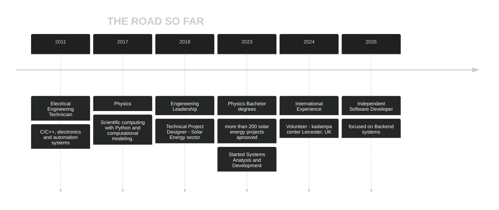




  Welcome to My Portfolio


 

Hi, My name is Diêgo!  

 

Software Developer with a background in Physics and Electrotechnics, focused on building reliable backend systems and technical tools.

 
Here I share my projects, experiments, and the systems I build along my journey.

Feel free to explore, and reach out if you'd like to work together.

I'm currently based on Brazil and I am open to Work, Be confortable to read, and mail me if your are interested.

 



>“Nobody ever figures out what life is all about, and it doesn't matter. Explore the world. Nearly everything is really interesting if you go into it deeply enough.”
> — Richard P. Feynman

>[!WARNING]
>My stack changes — my ability to learn doesn't.


  
  
  
  
  
  
  
  


