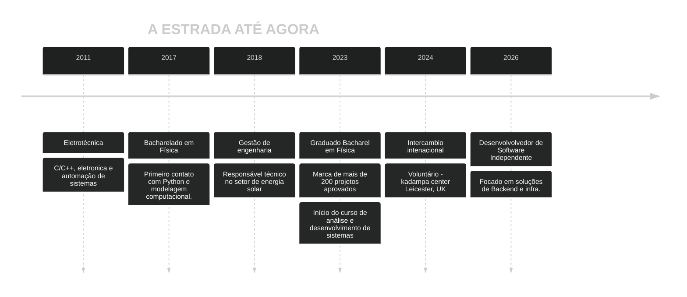




  Bem vindo ao meu portfólio


 

Oi, eu sou o Diêgo!  

Oi, meu nome é Diêgo!

Desenvolvedor de software com formação em Física e Eletrotécnica, focado em construir sistemas backend confiáveis e ferramentas técnicas.
 
Aqui compartilho meus projetos, experimentos e os sistemas que desenvolvo ao longo da minha jornada.
 
 
    Sinta-se à vontade para explorar e entrar em contato se quiser trabalhar comigo.
Atualmente estou baseado no Brasil e estou aberto a oportunidades de trabalho. Fique à vontade para navegar pelo site e me enviar um e-mail se tiver interesse.



>“Nobody ever figures out what life is all about, and it doesn't matter. Explore the world. Nearly everything is really interesting if you go into it deeply enough.”
> — Richard P. Feynman

>[!WARNING]
>Minha stack pode mudar — minha habilidade para aprender não.


  
  
  
  
  
  
  
  


